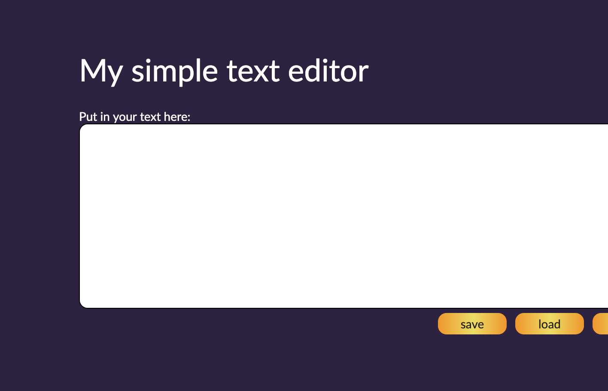

# Simple text editor

  Prosty projekt w którym ćwiczyłem użycie local storage, preprocesora SASS oraz Gulpa.
Zapraszam do sprawdzenia efektu: [kliknij tutaj](https://jedrzejch.github.io/simpleTxtEditor/)

